# Minicraft

**A C++20 remake of Notch's Minicraft, with online multiplayer built on a deterministic simulation.**

### ▶ [Play it in your browser](https://adnanebja.github.io/Minicraft/)
Compiled to WebAssembly. Type a name and you're in the shared world, with whoever else is playing.

Chop trees, mine down through three dark cave levels, craft your way from wooden tools to gem gear, then climb to the sky and beat the Air Wizard. Everyone who opens the link plays in the same world.

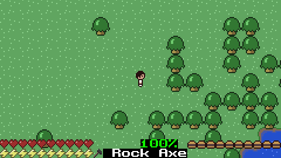

- **The game:** C++20 and SDL3, about 11k lines.
- **The simulation:** written once in `game-core`, a library with no graphics, sound or files. It's fully **deterministic**: the same seed and the same inputs always produce the same world, tick for tick.
- **In the browser:** the same C++ compiled to **WebAssembly** with Emscripten, published on GitHub Pages by CI. It stores nothing in the browser.
- **Multiplayer:** a lockstep design over **WebSockets**. A small relay server collects every player's inputs and sends the same 60 Hz ticks to everyone, and each client runs the identical simulation. One shared world per server, with chat, PvP, joining a world already in progress, and automatic desync detection.
- **Live stats:** the game server replays the world itself and reports every action (trees chopped, ores mined, creatures killed, deaths, levels reached) to a **Go** service backed by **PostgreSQL**, which serves a public dashboard with leaderboards. Each action counts exactly once, and nothing a browser sends can fake it.
- **Load-tested:** a Go bot fleet (`loadtest/`) plays the real protocol. With 32 players on an AWS t3.micro (the production machine type), a key press shows up in the world in 9.7 ms at the median (20 ms p99) plus the player's network round trip (32 ms median from a home PC), and the server used 4% of one core and 23 MB.
- **Observability:** a Go probe plays the live game every 30 s as a hidden observer and times joins and round trips through the tick loop; the game's health goes to **Prometheus**; public **Grafana** dashboards track four SLOs, whose recording rules are unit-tested in CI.
- **Tests:** 94 GoogleTest tests (the core rules, two-client lockstep, late-join replay, the stat events, the real server with real clients over localhost WebSockets) and Go tests against a real PostgreSQL. A Playwright script plays the web build in headless Chromium and checks the dashboard counted it.

---

## Contents
- [The game](#the-game)
- [Multiplayer](#multiplayer)
- [Live stats](#live-stats)
- [Performance](#performance)
- [Observability](#observability)
- [How it works](#how-it-works)
- [Getting started](#getting-started)
- [Controls](#controls)
- [Tests](#tests)
- [Project layout](#project-layout)
- [Status](#status)
- [Credits](#credits)

---

## The game

A faithful port of Minicraft's loop, built from the original Java sources as a reference. All the content below is in:

- **Five levels per world, generated from a seed:**
  - a 256×256 island with a day/night cycle;
  - three caves below it with iron, gold and gems, water and then lava, pitch black except where something gives light;
  - the sky above, all linked by stairs.
- **Survival:** health, energy and hunger; food and armour (leather to gem).
- **Tools and crafting:** tools that wear out (wood, rock, iron, gold, gem), each with a real use: axes for trees, pickaxes for rock and ore, shovels and hoes for soil. Six crafting stations: hand, workbench, furnace, oven, anvil and loom.
- **Building and farming:** farming (seeds and wheat), saplings, placeable floors, walls, doors and torches, chests, lanterns and beds.
- **Mobs:** each enemy has a level. Zombies, skeletons (shoot arrows), slimes, creepers (explode and dig craters) and snakes, plus passive cows, pigs and sheep.
- **The Air Wizard** boss in the sky, and a win screen.
- **Extras:** sound effects, a world map (Tab), saving and loading, and an F3 debug panel.

| The caves are dark: only you, torches and lanterns give light | The workbench, one of six crafting stations |
|---|---|
| 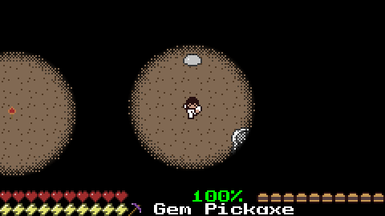 | 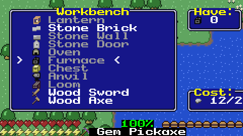 |
| **The map** (Tab) shows the way down to the caves and up to the boss | **The Air Wizard** casts spirals of sparks; arrows finish him off |
| 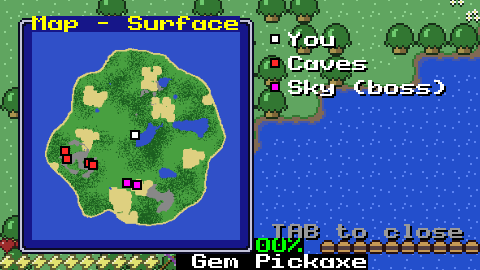 | 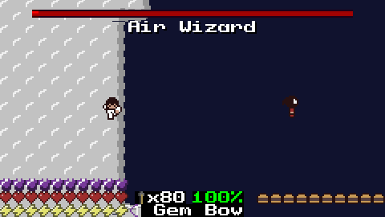 |

## Multiplayer

The game is online only. Opening it asks for a name, then puts you in the server's one world. The first player to arrive starts it, everyone after joins it, and it ends when the last player leaves. To keep joining fast, a world that has run for 3 hours resets for everyone (with a minute's warning in chat). Players see each other with name tags, chat with Enter, and can fight: punches, tools and arrows all hit other players. The world never pauses.

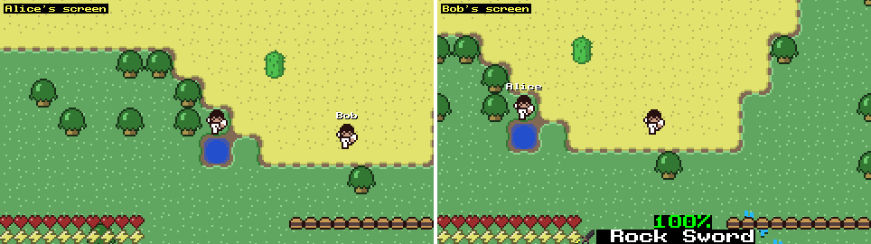

*Two clients, rendered side by side. Each one runs its own simulation from the same ticks, so both screens show exactly the same world from each player's point of view.*

| PvP: Bob loses, drops a death chest, and gets the death screen | Building together: Alice places a workbench, Bob crafts a sword on it |
|---|---|
| 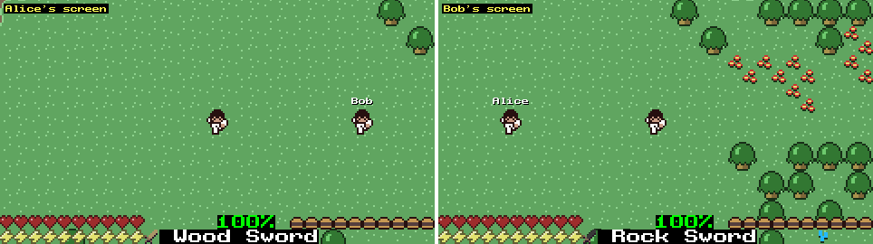 | 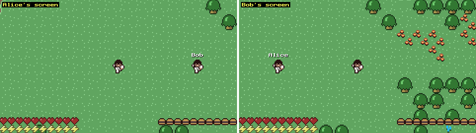 |

**The start screen:** type a name and press Enter to join the world.

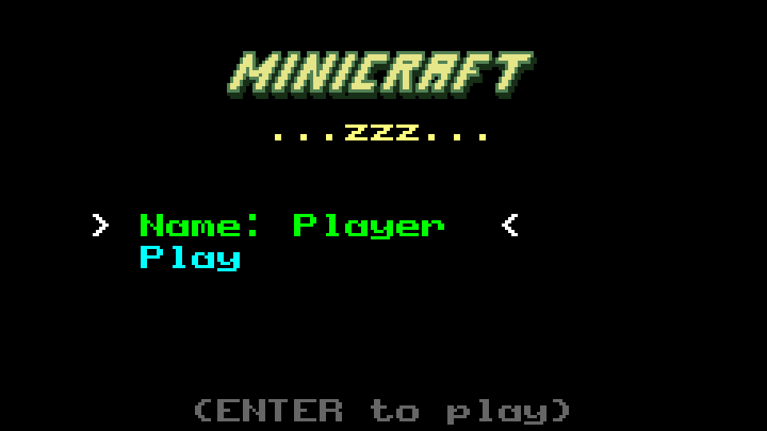

## Live stats

A public dashboard at `/stats` on the game server's domain (linked from the game page) shows what everyone has done in the world: players joined, time played, resources gathered per item, trees chopped and rocks mined, creatures killed by kind, deaths, Air Wizard defeats, six leaderboards (kills, longest life, time played, resources, PvP, deepest explorer), recent activity, a 7-day activity chart, and a page per player.

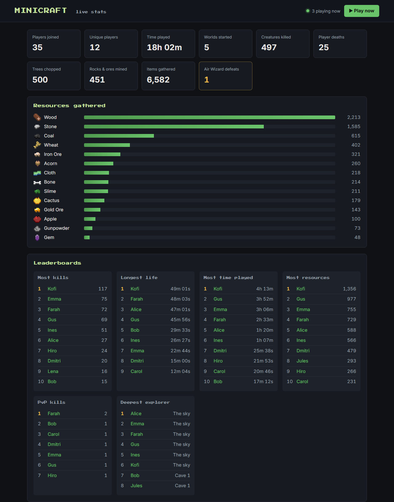

How it's built:
- **The game server reports, not the browsers.** `minicraft-server` keeps its own copy of the world (`StatsObserver`) and applies every tick it sends to the players, so it sees exactly what they see. `game-core` records stat events as it runs (a tile broken, items picked up or crafted, a mob or player killed and by whom, a level reached), and the observer turns player ids into names.
- **Batched, retried, counted once.** `StatsReporter` posts the events to the stats service once a second over HTTP, with a bearer token. Failed batches are kept and retried with backoff (a bounded backlog), and every event carries an id (world seed + tick + position), so a retried batch never counts twice.
- **Go + PostgreSQL.** The `stats/` service (`net/http`, `pgx`) validates each batch and stores it in one transaction: the raw event plus running totals per item, tile, mob and player. The dashboard is server-rendered (`html/template`), then kept live by a small script polling a JSON API every 10 seconds, with Chart.js for the timeline. The icons come straight from the game's sprite sheets.
- **Locked down.** Caddy routes only `/stats*` to the stats service; `/events` is reachable only inside the Docker network, and needs the token. Without the stats configuration the game server runs exactly as before.

Why the server replays the world: **[ADR 0003](docs/adr/0003-stats-from-an-authoritative-replay.md)**.

## Performance

Measured with the Go bot fleet in [`loadtest/`](loadtest): each bot joins over the real binary protocol, walks, attacks and chats, and times what a player feels. Every run had 32 players for 3.5 minutes.

| | On the production machine type<br/>(AWS t3.micro, bots on the box) | From a home PC<br/>(over the internet to us-east-1) | Local Linux<br/>(WSL2, 2 cores) |
|---|---|---|---|
| **Input latency** p50 / p99<br/>*key change sent → first tick that carries it* | **9.7 ms / 20 ms** | **32 ms / 73 ms** | 8.6 ms / 17 ms |
| **Tick jitter** p99<br/>*gap between ticks vs 16.7 ms, as received* | 6.2 ms | 9.0 ms | 0.65 ms |
| **Join time** p50 | 3.1 ms | 183 ms | 4.2 ms |
| **Server CPU** avg / max (of one core) | 4.0% / 13% | not sampled (remote) | 1.9% / 4.0% |
| **Server memory** (max) | 23 MB | not sampled (remote) | 23 MB |

- **What a player feels:** about one network round trip plus half a tick. From the home PC the round trip to the server was 27 ms (median TCP connect), plus 8 ms of waiting for the next tick on average: 35 ms predicted, 32 ms measured. In lockstep a key press waits for the next 60 Hz tick: on average half a tick (8.3 ms), at most one (16.7 ms). See [ADR 0004](docs/adr/0004-lockstep-input-latency.md).
- **The server isn't the bottleneck:** 32 players cost a t3.micro 4% of one core and 23 MB of memory, for 520 KB/s of ticks out.
- **Breaking point:** ramping 4 bots every 15 s on the t3.micro, latency stays flat (p99 17–36 ms at every step) until 36 bots, where the server's 32-player limit refuses connections. The limit is a design choice, not a capacity one.
- **One thing it found:** a player joining late downloads the world's whole tick history (about 1–2 MB after a few minutes with 20+ players). Ramping 32 bots from one home connection, each wave of joins briefly saturated that connection and delayed everyone's ticks (p99 up to 430 ms while p50 stayed at 33 ms). The same ramp on the server machine stayed flat, so this is about many players sharing one link, not the server. Shorter histories (snapshots instead of a full replay) would shrink these downloads.

Full reports, with their environments: [`docs/perf/`](docs/perf). Reproduce:
```sh
cd loadtest
go run ./cmd/loadtest --bots 32 --ramp 30s --duration 3m --server-pid <pid>   # steady
go run ./cmd/loadtest --mode ramp --bots 40 --step 4 --every 15s              # find the breaking point
```
CI runs an 8-bot load test against the real server on every push.

## Observability

Live, public dashboards: **[minicraft-adnane.duckdns.org/grafana](https://minicraft-adnane.duckdns.org/grafana/)** (read-only).

- **A synthetic player.** A Go probe ([`loadtest/cmd/probe`](loadtest/cmd/probe)) joins the live game every 30 s through the public `wss://` address, as a **hidden observer**: it gets the world and its ticks, but no player sees it and it counts nowhere. It times the join, then 10 pings that the server answers right after its next tick, the same path a key press takes.
- **The game's health.** With every stats batch (once a second), the game server also reports its connections, ticks, the world's history size (what a late joiner downloads), its backlog, memory and CPU. The Go stats service serves them, with its own ingest numbers, to **Prometheus**.
- **Two Grafana dashboards:** *player experience* (probe results, join time, input latency, tick jitter, SLO status) and *server internals* (players, history growth, memory and CPU per service, ingest, scrape health).

| SLO (rolling hour) | Target |
|---|---|
| Probe runs that succeed | ≥ 99% |
| Joins under 1 s | ≥ 99% |
| Pings answered under 50 ms | ≥ 99% |
| Game server reported in the last 30 s, every target up | always |

The SLO ratios are Prometheus recording rules, unit-tested with `promtool test rules` in CI. Alerts show on the dashboard. Why it's built this way: [ADR 0005](docs/adr/0005-observability.md).

## How it works

### Architecture

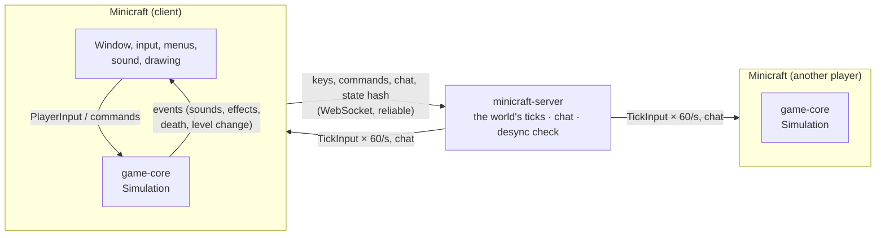

| Part | What it does |
|---|---|
| [`game-core/`](game-core) | **The whole game, written once**: world generation, tiles, items and recipes, players, mobs, combat, the day cycle. `Simulation::tick(TickInput)` advances the world by one 60 Hz tick. No SDL, no rendering, no files, and no global state: randomness comes from one seeded generator (xoshiro128**) inside the simulation. |
| [`net-common/`](net-common) | The messages the client and server exchange ([`protocol.h`](net-common/protocol.h) explains the design at the top), and how they are turned into bytes. Every read from the network is bounds-checked. |
| [`server/`](server) | `minicraft-server`: WebSocket server, the one world's 60 Hz tick relay, tick history for late joiners, chat, desync detection. **It runs no game.** |
| [`client/`](client) | The SDL3 game: renderers, menus, audio, chat, and the network client. |
| [`stats/`](stats) | The Go stats service: ingestion into PostgreSQL, the JSON API, the dashboard, and the game's metrics for Prometheus. |
| [`loadtest/`](loadtest) | The Go load-testing bots and the monitoring probe. |
| [`deploy/`](deploy) | Docker Compose: the server, the stats service, PostgreSQL, the probe, Prometheus and Grafana, behind Caddy. |

### Lockstep: why the server runs no game

Every client runs the same deterministic simulation. So the server doesn't need to send the world, only what everyone did:

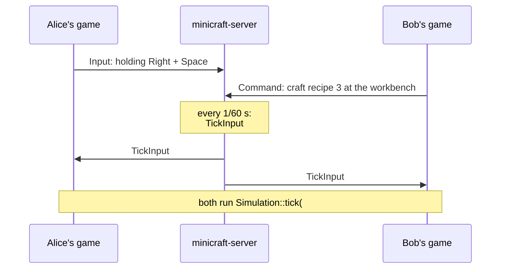

- **Everything that changes the world is an input:** joining, leaving, crafting, moving items between a chest and the inventory, respawning. These are `PlayerCommand`s inside a tick, so every client applies them on the same tick.
- **Bandwidth is tiny:** a few bytes per player per tick, instead of world snapshots.
- **Joining a running world** downloads the world's tick history and replays it to catch up. The simulation runs about 11,000 ticks per second even in a Debug build, so 10 minutes of play replays in about 3 seconds.
- **Desync detection:** once a second, each client sends a 64-bit fingerprint of its world (`Simulation::stateHash()`). If two players' fingerprints differ for the same tick, the server announces it in chat.
- **Events, not side effects:** the simulation never plays a sound or draws anything. It records events (sound, damage number, "player died") tagged with the level they happened on and, for personal ones, the player they're for. Each client acts on the events that concern it.

The trade-offs (input latency without client prediction, every client knowing the whole world, the same build required everywhere) are written up in **[ADR 0001: Multiplayer as lockstep](docs/adr/0001-multiplayer-lockstep-over-enet.md)**. Why the transport became WebSockets, so the game runs in a browser: **[ADR 0002](docs/adr/0002-websocket-transport.md)**.

## Getting started

### Requirements
- **CMake** 3.25 or newer, **Ninja**, and a **C++20** compiler. Tested on Windows 11 with MinGW-w64 GCC 13, the toolchain CLion bundles.
- An internet connection on the first configure. CMake's FetchContent downloads and builds SDL3, Dear ImGui, IXWebSocket and GoogleTest. Nothing else needs installing.

### Build

**CLion:** open the folder and wait for CMake to load. Then run the `Minicraft` target, the `minicraft-server` target or `game_core_tests`.

**Terminal:**
```sh
git clone https://github.com/AdnaneBJA/Minicraft.git
cd Minicraft
cmake -S . -B build -G Ninja
cmake --build build          # the first build also compiles SDL3: a few minutes
```
This produces `build/Minicraft` (the game), `build/minicraft-server` and `build/game_core_tests`. The game finds its `assets/` folder next to the executable, and the build copies it there. With MinGW the C++ runtime is linked in, so the executables also start from Explorer.

### Web build
With Docker, using the same Emscripten as CI:
```sh
docker run --rm -v "$PWD":/src -w /src emscripten/emsdk:6.0.10 sh -c \
  "apt-get update -qq && apt-get install -y -qq ninja-build && \
   emcmake cmake -S . -B build-web -G Ninja -DCMAKE_BUILD_TYPE=Release -DMINICRAFT_SERVER_URL=ws://localhost:7777 && \
   cmake --build build-web"
```
This produces `build-web/Minicraft.html` with its `.js`, `.wasm` and `.data`. Serve the folder over HTTP (for example `python -m http.server -d build-web`) and open `Minicraft.html`. `MINICRAFT_SERVER_URL` is the server the page connects to.

### Play together
**Online:** open the [web version](https://adnanebja.github.io/Minicraft/) and enter a name. It connects to the hosted server. How that server is set up (Docker, Caddy for HTTPS, a free VM): **[deploy/README.md](deploy/README.md)**.

**On your own machine or LAN:**
1. Start the server: `build/minicraft-server` (port 7777), or `build/minicraft-server 9000` for another port. Open that TCP port in your firewall to play over a network.
2. Each player runs the desktop `Minicraft` and enters a name and the server's address: `localhost`, a LAN IP like `192.168.1.20`, or `host:port`. Everyone lands in the same world; you can join at any time, and the game catches up first.

All players should run the same build, since lockstep needs bit-identical simulations; the desync check will tell you if they aren't.

## Controls

| Key | Action |
|---|---|
| WASD / arrows | Move |
| Space | Attack, or use the held item. Hold it to repeat. |
| E | Inventory, or use the furniture in front (stations, chests, beds) |
| Z | Craft by hand |
| Tab | World map |
| Enter | Chat |
| Esc | Menu (the game keeps going) |
| M | Mute |
| F3 | Debug panel (it can only look) |

## Tests

```sh
cmake --build build
ctest --test-dir build --output-on-failure
```

52 tests on `game-core`:
- **Determinism:** the same seed and inputs give the same state hash, by day and at night. A different seed, or a single different keypress, gives a different hash.
- **Lockstep:** two simulations fed the same 2,400 ticks stay identical, a late joiner replaying them matches, and a simulation reused for a new world (leave and rejoin) matches a fresh one.
- **World generation (3 seeds):** stairs down always lead to stairs up on the level below, each cave has its ore, and the boss is in the sky.
- **Gameplay rules:** mining, smelting, hard rock, farming, liquids, building, bows, food and armour, hunger, the power glove, creepers, skeletons, the boss, death chests.
- **Multiplayer:** joining and leaving, PvP punches and arrows, several levels simulated at once, beds.
- **Stat events:** chopping a tree and picking up the wood, sword and arrow kills credited to the right player, a death in lava, a PvP kill, a creeper blast (no self-kills), the boss defeat (for everyone, credited to its killer), crafting, reaching a cave once per life, and the same events from two simulations fed the same ticks.

42 tests on the server (`server_tests`), including one that keeps the Go bots' protocol in step with C++ (it writes byte fixtures the Go tests decode), and the stats reporting (named events from the replay, batches with the token, heartbeats, retries that arrive once, the bounded backlog, no reporting without configuration). The rest: a real `minicraft-server` on localhost and real game clients over WebSockets. They cover joining the world, both players getting the same ticks, chat, leaving, a late joiner's history, the world ending when empty and resetting when old, invalid and duplicate names, a full server, a large message, an unreachable or silent server, an unresponsive client, and a player vanishing mid-game. And the monitoring probe's side: an observer gets the world and its ticks without being in it (or able to play), pings are answered after the next tick (even with no world), only probes with the token may observe, the observer limit, a full server with every observer slot taken, and the health sent with every stats batch.

**Stats service (Go):** `cd stats && go test ./...` runs against a real PostgreSQL 17 (an embedded one locally, a service container in CI): validation, idempotent ingestion, every tally, the leaderboards, the JSON API, the pages (also over an empty database), the token check, and the `/metrics` output (a retried old batch never rolls the gauges back).

**Load-testing bots (Go):** `cd loadtest && go test -race ./...`: the protocol against the C++ fixtures (and fuzzed), the histograms, the bots against a fake server with a known delay, every run mode, and the probe (a good run, a refusal, a dead address, a stalled server, lost pongs, a world reset mid-run).

**Monitoring:** `promtool check config` and `promtool test rules` on the Prometheus config and SLO rules, and the Grafana files parse.

**Browser:** [`web/smoke/smoke.mjs`](web/smoke/smoke.mjs) plays the web build in headless Chromium with Playwright. Two players type names, land in the same world and chat; one leaves and rejoins; a third can't take a name in use; and the canvas follows the window. Given the stats service's address, it also checks the dashboard counted the visit.

CI runs the tests on Linux for every push, and builds the web version for every pull request.

## Project layout

```
game-core/    the simulation (static library, no SDL) + tests/
net-common/   client/server protocol and the WebSocket client (browser and native)
server/       minicraft-server + tests/, and its Dockerfile
loadtest/     the Go load-testing bots (protocol, bots, metrics, reports) and the monitoring probe
stats/        the Go stats service (ingestion, PostgreSQL, API, dashboard) and its Dockerfile
client/       the SDL3 game (desktop and browser)
web/          the web page around the game (shell.html) and the browser smoke test
deploy/       Docker Compose + Caddy for the hosted server, Prometheus and Grafana, and how to set it up
assets/       sprites, sound effects, ASSETS.md (sources and licenses)
docs/         architecture decisions (adr/) and the media in this README
```

## Status

- [x] The full Minicraft game, with its rules in a deterministic, tested core library
- [x] Online: one shared world, chat, PvP, late join by replay, desync detection
- [x] In the browser (WebAssembly), with a hosted server
- [x] Live stats dashboard (Go + PostgreSQL), fed by the server's replay of the world

## Credits

- **The original Minicraft** by Markus "Notch" Persson (Ludum Dare 22). This remake follows [Minicraft+ Revived](https://github.com/MinicraftPlus/minicraft-plus-revived), whose sprites and sound effects it uses (GPL-3.0). Every asset's source is listed in [`assets/ASSETS.md`](assets/ASSETS.md).
- **Libraries:** [SDL3](https://github.com/libsdl-org/SDL), [IXWebSocket](https://github.com/machinezone/IXWebSocket), [Emscripten](https://emscripten.org), [Caddy](https://caddyserver.com), [Dear ImGui](https://github.com/ocornut/imgui), [GoogleTest](https://github.com/google/googletest).

A personal learning project, not distributed or sold.
