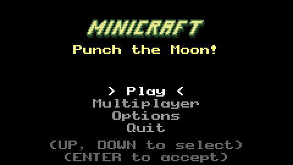
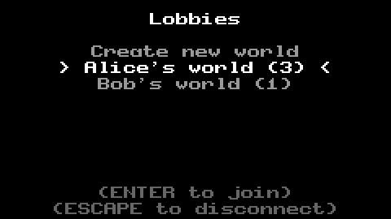
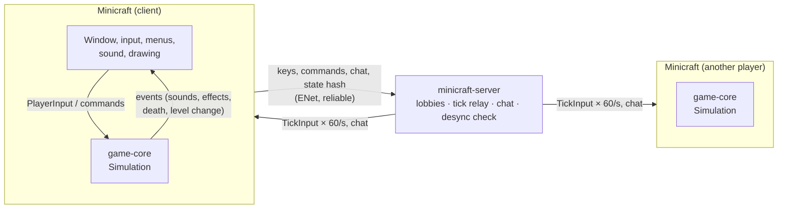
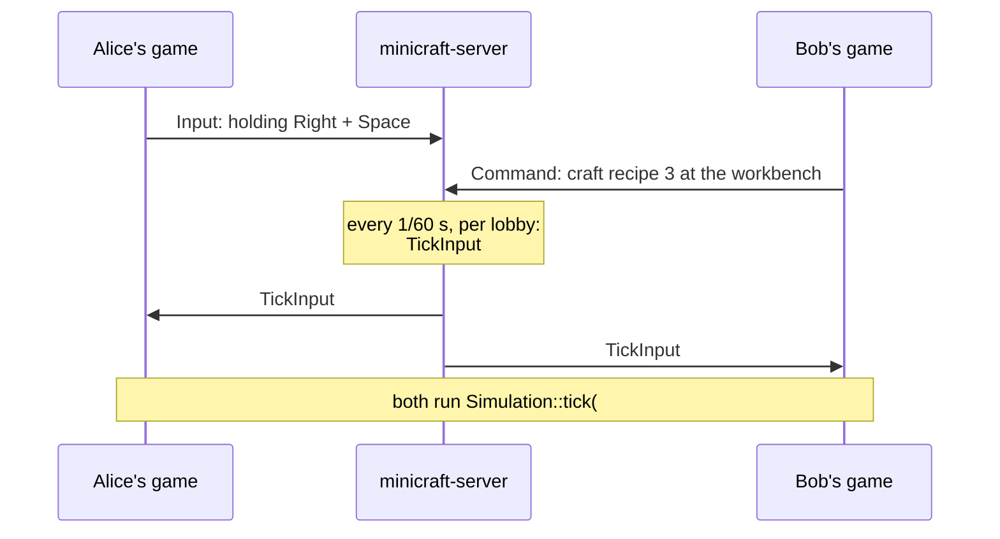

# Minicraft

**A C++20 remake of Notch's Minicraft, with online multiplayer built on a deterministic simulation.**

Chop trees, mine down through three dark cave levels, craft your way from wooden tools to gem gear, then climb to the sky and beat the Air Wizard. Play alone, or start a world on a server and have friends join it.


- **The game:** C++20 and SDL3, about 11k lines.
- **The simulation:** written once in `game-core`, a library with no graphics, sound or files. It's fully **deterministic**: the same seed and the same inputs always produce the same world, tick for tick.
- **Multiplayer:** a lockstep design over **ENet**. A small relay server collects every player's inputs and sends the same 60 Hz ticks to everyone, and each client runs the identical simulation. Includes lobbies, chat, PvP, joining a world already in progress, and automatic desync detection.
- **Tests:** 41 GoogleTest tests on the core rules, including two-client lockstep and late-join replay.

---

## Contents
- [The game](#the-game)
- [Multiplayer](#multiplayer)
- [How it works](#how-it-works)
- [Getting started](#getting-started)
- [Controls](#controls)
- [Tests](#tests)
- [Project layout](#project-layout)
- [Roadmap](#roadmap)
- [Credits](#credits)

---

## The game

A faithful port of Minicraft's loop, built from the original Java sources as a reference. All the content below is in:

- **Five levels per world, generated from a seed:**
  - a 256×256 island with a day/night cycle;
  - three caves below it with iron, gold and gems, water and then lava, pitch black except where something gives light;
  - the sky above, all linked by stairs.
- **Survival:** health, energy and hunger; food and armour (leather to gem).
- **Tools and crafting:** tools that wear out (wood, rock, iron, gold, gem), each with a real use: axes for trees, pickaxes for rock and ore, shovels and hoes for soil. Six crafting stations: hand, workbench, furnace, oven, anvil and loom.
- **Building and farming:** farming (seeds and wheat), saplings, placeable floors, walls, doors and torches, chests, lanterns and beds.
- **Mobs:** each enemy has a level. Zombies, skeletons (shoot arrows), slimes, creepers (explode and dig craters) and snakes, plus passive cows, pigs and sheep.
- **The Air Wizard** boss in the sky, and a win screen.
- **Extras:** sound effects, a world map (Tab), saving and loading, and an F3 debug panel.

| The caves are dark: only you, torches and lanterns give light | The workbench, one of six crafting stations |
|---|---|
|  |  |
| **The map** (Tab) shows the way down to the caves and up to the boss | **The Air Wizard** casts spirals of sparks |
|  |  |

## Multiplayer

Run `minicraft-server`, choose **Multiplayer** in the game, then create a world or join one from the lobby list. Players see each other with name tags, chat with Enter, and can fight: punches, tools and arrows all hit other players. An online world never pauses.


*Two clients, rendered side by side. Each one runs its own simulation from the same ticks, so both screens show exactly the same world from each player's point of view.*

| Title screen | Lobby list |
|---|---|
|  |  |

## How it works

### Architecture



| Part | What it does |
|---|---|
| [`game-core/`](game-core) | **The whole game, written once**: world generation, tiles, items and recipes, players, mobs, combat, the day cycle. `Simulation::tick(TickInput)` advances the world by one 60 Hz tick. No SDL, no rendering, no files, and no global state: randomness comes from one seeded generator (xoshiro128**) inside the simulation. |
| [`net-common/`](net-common) | The messages the client and server exchange ([`protocol.h`](net-common/protocol.h) explains the design at the top), and how they are turned into bytes. Every read from the network is bounds-checked. |
| [`server/`](server) | `minicraft-server`: ENet host, lobbies, the 60 Hz tick relay, tick history for late joiners, chat, desync detection. **It runs no game.** |
| [`client/`](client) | The SDL3 game: renderers, menus, audio, saves, chat, and the network client. |

### Lockstep: why the server runs no game

Every client runs the same deterministic simulation. So the server doesn't need to send the world, only what everyone did:



- **Everything that changes the world is an input:** joining, leaving, crafting, moving items between a chest and the inventory, respawning. These are `PlayerCommand`s inside a tick, so every client applies them on the same tick. Single-player uses the same path; the game just makes its own ticks.
- **Bandwidth is tiny:** a few bytes per player per tick, instead of world snapshots.
- **Joining a running world** downloads the lobby's tick history and replays it to catch up. The simulation runs about 11,000 ticks per second even in a Debug build, so 10 minutes of play replays in about 3 seconds.
- **Desync detection:** once a second, each client sends a 64-bit fingerprint of its world (`Simulation::stateHash()`). If two players' fingerprints differ for the same tick, the server announces it in chat.
- **Events, not side effects:** the simulation never plays a sound or draws anything. It records events (sound, damage number, "player died") tagged with the level they happened on and, for personal ones, the player they're for. Each client acts on the events that concern it.

The trade-offs (input latency without client prediction, every client knowing the whole world, the same build required everywhere) are written up in **[ADR 0001: Multiplayer as lockstep over ENet](docs/adr/0001-multiplayer-lockstep-over-enet.md)**.

## Getting started

### Requirements
- **CMake** 3.25 or newer, **Ninja**, and a **C++20** compiler. Tested on Windows 11 with MinGW-w64 GCC 13, the toolchain CLion bundles.
- An internet connection on the first configure. CMake's FetchContent downloads and builds SDL3, Dear ImGui, ENet and GoogleTest. Nothing else needs installing.

### Build

**CLion:** open the folder and wait for CMake to load. Then run the `Minicraft` target, the `minicraft-server` target or `game_core_tests`.

**Terminal:**
```sh
git clone https://github.com/AdnaneBJA/Minicraft.git
cd Minicraft
cmake -S . -B build -G Ninja
cmake --build build          # the first build also compiles SDL3: a few minutes
```
This produces `build/Minicraft` (the game), `build/minicraft-server` and `build/game_core_tests`. The game finds its `assets/` folder next to the executable, and the build copies it there. With MinGW the C++ runtime is linked in, so the executables also start from Explorer.

### Play alone
Run `Minicraft`, then choose **Play → New World**. Worlds are saved to your user folder (`%APPDATA%/Minicraft/Minicraft/saves` on Windows).

### Play together
1. Start the server: `build/minicraft-server` (port 7777), or `build/minicraft-server 9000` for another port. Open that UDP port in your firewall to play over a network.
2. Each player runs `Minicraft` and picks **Multiplayer**. Enter a name and the server's address: `localhost`, a LAN IP like `192.168.1.20`, or `host:port`.
3. One player picks **Create new world**; the others pick it from the lobby list. You can join a world at any time, and the game catches up first.

All players should run the same build, since lockstep needs bit-identical simulations; the desync check will tell you if they aren't.

## Controls

| Key | Action |
|---|---|
| WASD / arrows | Move |
| Space | Attack, or use the held item. Hold it to repeat. |
| E | Inventory, or use the furniture in front (stations, chests, beds) |
| Z | Craft by hand |
| Tab | World map |
| Enter | Chat (multiplayer) |
| Esc | Pause menu (single-player) / menu (multiplayer: the game keeps going) |
| M | Mute |
| F3 | Debug panel (in multiplayer it can only look) |

## Tests

```sh
cmake --build build --target game_core_tests
./build/game_core_tests
```

41 tests on `game-core`:
- **Determinism:** the same seed and inputs give the same state hash, by day and at night. A different seed, or a single different keypress, gives a different hash.
- **Lockstep:** two simulations fed the same 2,400 ticks stay identical, and a late joiner replaying them matches.
- **World generation (3 seeds):** stairs down always lead to stairs up on the level below, each cave has its ore, and the boss is in the sky.
- **Gameplay rules:** mining, smelting, hard rock, farming, liquids, building, bows, food and armour, hunger, the power glove, creepers, skeletons, the boss, death chests.
- **Multiplayer:** joining and leaving, PvP punches and arrows, several levels simulated at once, beds.

## Project layout

```
game-core/    the simulation (static library, no SDL) + tests/
net-common/   client/server protocol and ENet helpers
server/       minicraft-server
client/       the SDL3 game
assets/       sprites, sound effects, ASSETS.md (sources and licenses)
docs/         architecture decisions (adr/) and the media in this README
```

## Roadmap

This is a portfolio project about distributed systems: the game is the vehicle. What's done and what's next:

- [x] The full single-player game, with its rules in a deterministic, tested core library
- [x] Multiplayer: lobbies, chat, PvP, late join by replay, desync detection
- [ ] Client-side prediction, so your own movement feels instant over the internet
- [ ] A browser build (WebAssembly) and a hosted demo
- [ ] Java/Spring services: accounts and connect tokens, a fleet of game servers, saved worlds in Postgres, leaderboards in Redis
- [ ] Game events streamed through Kafka to Python/PyTorch (play-style clustering, an RL-trained boss)
- [ ] Docker Compose and Kubernetes deployment, CI with sanitizers, Grafana dashboards, load tests with hundreds of bots

Progress is tracked in [`PROGRESS.md`](PROGRESS.md).

## Credits

- **The original Minicraft** by Markus "Notch" Persson (Ludum Dare 22). This remake follows [Minicraft+ Revived](https://github.com/MinicraftPlus/minicraft-plus-revived), whose sprites and sound effects it uses (GPL-3.0). Every asset's source is listed in [`assets/ASSETS.md`](assets/ASSETS.md).
- **Libraries:** [SDL3](https://github.com/libsdl-org/SDL), [ENet](https://github.com/lsalzman/enet), [Dear ImGui](https://github.com/ocornut/imgui), [GoogleTest](https://github.com/google/googletest).

A personal learning project, not distributed or sold.
